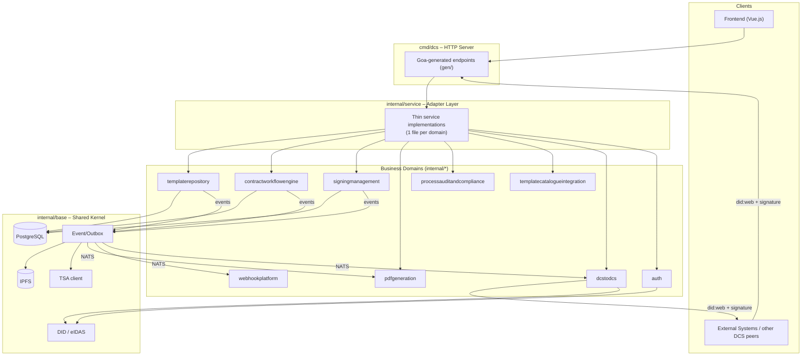
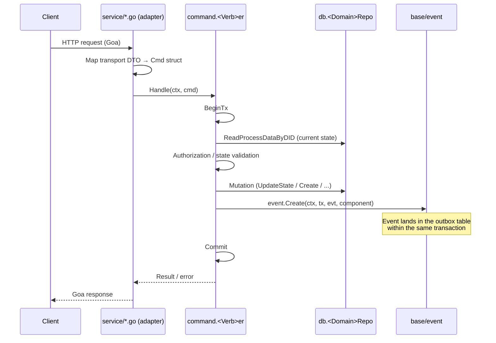
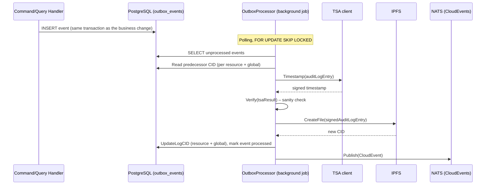
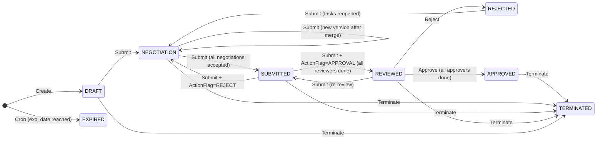
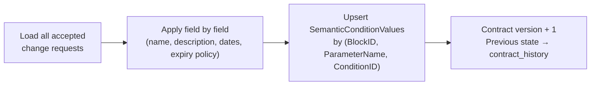
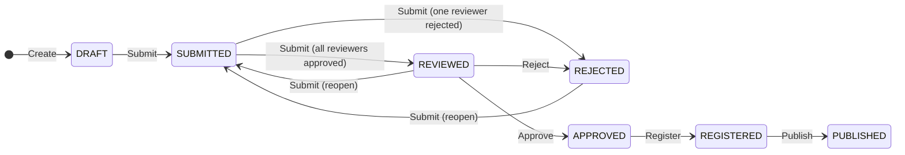
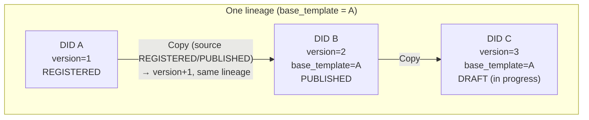
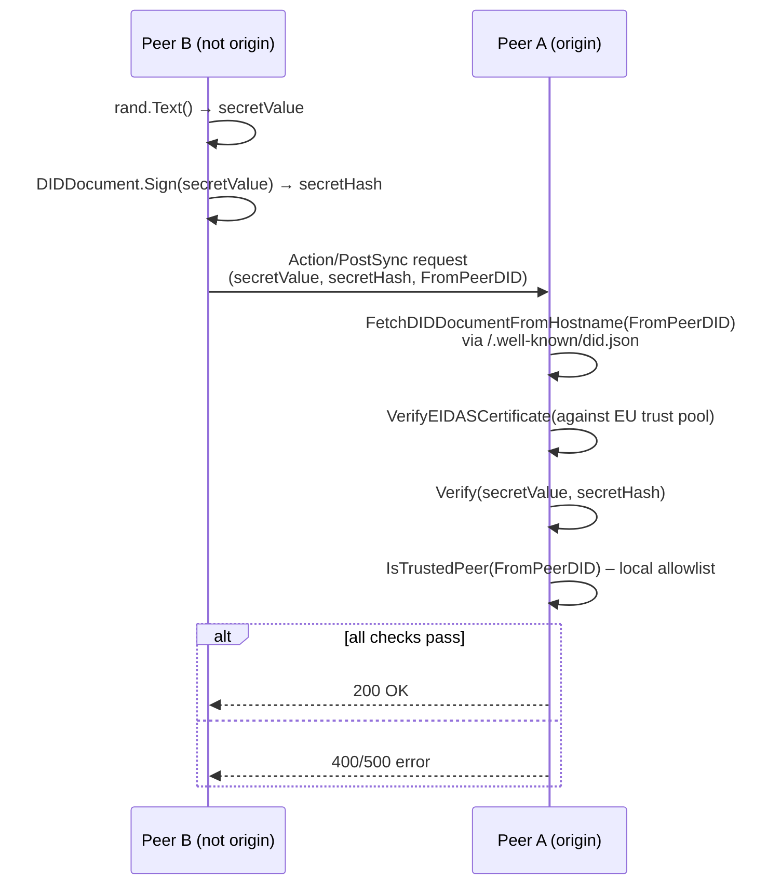
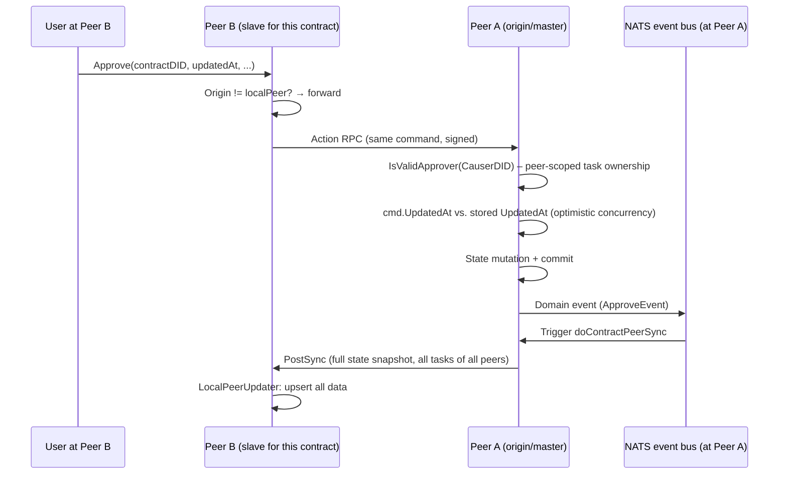

# DCS Backend – Architecture Documentation

**Status:** Living Document
**Audience:** Software architects, developers, technical stakeholders on the client side
**Scope:** `backend/` of the Digital Contracting Service (DCS)

> Related decision records: see [decisions/](decisions/) for the individual Architecture Decision Records (ADRs) referenced throughout this document.

---

## 1. Purpose and Context

The Digital Contracting Service (DCS) is a Go backend that manages the full lifecycle of digital contracts in a Gaia-X / Federated Catalogue context: from template creation through negotiation, review, and approval to digital signing and a tamper-evident audit trail. A central characteristic is **federation between multiple DCS instances** run by different operators, which must keep shared contracts in sync without implicitly trusting one another.

This document describes the architecture as it emerges from the codebase — as a reference for onboarding, architectural decisions, and client communication.

---

## 2. Technology Stack

| Building Block | Technology | Purpose |
|---|---|---|
| Language/Runtime | Go 1.25 | Backend service |
| API Framework | [Goa v3](https://goa.design) (design-first) | DSL-based API definition, code generation for transport/types |
| Database | PostgreSQL (`sqlx`) | Transactional persistence per domain |
| Event Bus | NATS (CloudEvents format) | Cross-domain asynchronous communication |
| Immutable Storage | IPFS | Anchor storage for signed audit-log entries |
| Time-Stamping Authority | TSA client (RFC 3161-style) | Trusted timestamps for audit entries |
| Identity | `did:web` + eIDAS certificates | Peer-to-peer trust between DCS instances |
| Authentication (end user) | Ory Hydra (OIDC), OID4VP/SD-JWT | Login, session, verifiable presentations |
| Provenance | C2PA manifests, W3C Verifiable Credentials | Provable origin of PDF artifacts |

---

## 3. High-Level Architecture



**Key observation:** This is a **modular monolith**, not microservices — all domains run in the same process and share a single PostgreSQL instance, but are decoupled through clear module boundaries and an internal event bus (NATS). See [ADR-0001](decisions/0001-cqrs-per-domain.md).

---

## 4. Folder Structure

```
backend/
├── cmd/
│   ├── dcs/            # Composition root: HTTP server startup, dependency wiring
│   └── dcs-cli/         # CLI tooling
├── design/              # Goa DSL – one file per domain API
├── gen/                 # Goa-generated code (DO NOT edit manually)
├── migrations/          # SQL migrations, Federated Catalogue schemas
└── internal/
    ├── base/            # Shared kernel: DB, event/outbox, identity, IPFS, TSA, validation
    ├── service/         # Thin adapters between Goa transport and domain handlers
    ├── middleware/       # JWT context extraction (participant ID, holder DID, roles)
    └── <domain>/         # One business domain, see section 5
```

Each business domain under `internal/<domain>/` follows — where applicable — the same internal skeleton:

```
<domain>/
├── command/       # Write use-cases: 1 file = 1 verb = 1 Goa endpoint
│   └── create.go  #   → <Verb>Cmd (input struct) + <Verb>er/<Verb>Handler (execution)
├── query/          # Read use-cases, same naming scheme
├── db/             # Repository interfaces (db/pg/ = Postgres implementation)
├── datatype/       # Domain enums: state machines, flags, one subfolder each
├── event/          # Domain events for the outbox/audit mechanism
└── error/          # (optional) domain-specific error types
```

---

## 5. Domain Overview

The domain split is a **business-driven** decomposition (bounded contexts), not a purely technical one. Not every domain needs the full CQRS pattern — the split follows actual need:

| Domain | Command | Query | Character |
|---|---|---|---|
| `contractworkflowengine` | ✅ (13) | ✅ (9) | Core domain: contract lifecycle, negotiation, approval |
| `templaterepository` | ✅ (10) | ✅ (7) | Template lifecycle, versioning, catalogue publishing |
| `templatecatalogueintegration` | ✅ (8) | ✅ (12) | Integration with the Gaia-X Federated Catalogue |
| `signingmanagement` | ✅ (4) | ✅ (5) | Digital signing (DSS integration) |
| `pdfgeneration` | – | ✅ (5) | Purely event-driven (C2PA/provenance), no user commands |
| `processauditandcompliance` | – | ✅ (7) | Read-only access to the cross-domain audit trail |
| `dcstodcs` | – | – | Orchestration; the actual commands live in `contractworkflowengine/remotesync` |
| `auth`, `webhookplatform`, `semantic`, `cryptoprovider`, `base`, `middleware` | – | – | Infrastructure, adapters, or stateless utilities — no business aggregate |

**Why some domains have no CQRS split:** `pdfgeneration` and `processauditandcompliance` are either purely event-driven (no direct user command) or purely read-only. `service/` is deliberately the thin translation layer between Goa and the domain handlers and contains no business logic of its own. `dcstodcs` only orchestrates — the actual state-mutating commands executed during sync deliberately live in the domain the data belongs to (`contractworkflowengine/remotesync/command`), not in the sync infrastructure domain.

---

## 6. The CQRS Pattern in Detail

Every command handler follows the exact same flow:



The command handler bundles only the repository dependencies that *this specific* use case needs (dependency injection at the handler level, not the service level) — e.g. `command.Approver` carries exactly `CRepo`, `ATRepo`, `SRepo`, `DIDDocument`.

---

## 7. Event Sourcing & Tamper-Evident Audit Trail

Every write **and** read operation produces a domain event, which is carried through a transactional outbox pattern into an immutable, externally anchored audit trail. See [ADR-0003](decisions/0003-event-sourced-audit-trail.md).



Every audit entry references both the **previous CID of the same resource** and the **previous global CID** — a hash chain similar to a blockchain, combined with a trusted timestamp. This makes retroactive tampering with the audit trail detectable.

---

## 8. Contract Workflow Engine: State Machine



**Key principles:**

- **Fan-out/fan-in over tasks:** A contract state transition (`REVIEWED → APPROVED`) only fires once *all* associated tasks (review/approval/negotiation, one per responsible peer) are closed.
- **`Submit` is the central, overloaded transition** — its behavior depends entirely on the current state (state pattern via `if/else`, not polymorphism).
- **Immediately consistent expiry detection:** the DB view `contracts_effective` computes `EXPIRED` at read time as soon as `exp_date` has passed — independent of the asynchronously lagging cron job that writes the physical state value and emits the corresponding event.
- **Task ownership is peer-scoped, not user-scoped:** `Approvers`/`Reviewers`/`Negotiators` in `Responsible` are peer DIDs (other DCS instances), not individual people. Individual roles (`ContractApprover`, etc.) are additionally checked purely locally via RBAC.

### Negotiation Merging

Once the last open negotiation task is closed, `MergeChangeRequests` folds all **accepted** change requests of the current version together:



Conflict strategy: **last-write-wins** in persistence order — there is no explicit conflict detection between contradictory change requests from multiple negotiators.

---

## 9. Template Repository: State Machine & Versioning



### Versioning Strategy: Copy-on-Version

Unlike contracts, there is **no mutable "current row"** — every template version is its own row with its own DID. See [ADR-0006](decisions/0006-versioning-strategies.md).



The `Copy` command performs two different roles depending on the state of the source:
- Source **not yet** registered/published → the copy starts a **new, independent lineage** (`base_template` = its own new DID, `version = 1`)
- Source **already** registered/published → the copy inherits the source's `base_template`, `version + 1`

A SQL guard prevents competing version numbers within the same lineage. Which version is "the current one" is computed **at read time** via a window function (`outdated` flag, `latest_did` pointer), not persisted.

### Comparison: Template vs. Contract Versioning

| | Templates | Contracts |
|---|---|---|
| Model | Copy-on-version: new DID per version | In-place: one DID, version counter |
| Chaining | `base_template` foreign key | Not needed (DID stays stable) |
| History | Every version is its own row | Separate `contract_history` table (append-only snapshots) |
| Trigger | Explicit `Copy` call (user action) | Implicit trigger via negotiation merge |

---

## 10. DCS-to-DCS Synchronization

DCS instances run by different operators synchronize shared contracts through a **single-writer-per-aggregate** model. See [ADR-0004](decisions/0004-did-web-eidas-trust.md) and [ADR-0005](decisions/0005-single-writer-peer-sync.md).

### Trust Model



Trust rests on three independent layers: an **eIDAS certificate chain** (regulatory anchor, EU trusted lists), a **challenge-response signature** (proof of possession of the private `did:web` key per request), and a **local trusted-peer allowlist** (explicit acceptance by the operator).

### Single-Writer-per-Aggregate ("Master-Slave per Contract")



**Key properties:**

- The "master" (`Origin`) is fixed **per contract**, not globally — a node can be master for its own contracts and slave for others.
- Task ownership (who may change an approval/review/negotiation task) is **peer-scoped**: the requesting peer DID (`CauserDID`) is checked against the peer DID stored on the task — not the individual end user.
- All peers hold a **full copy** of every task belonging to every other peer (full replication via `PostSync`), but only the assigned peer may change its own task.
- Optimistic concurrency control via a client-supplied `updated_at` timestamp (see [ADR-0007](decisions/0007-optimistic-concurrency-timestamp.md)) prevents overwriting a state that has changed in the meantime.
- Failed syncs land in a retry queue (`sync_fails`) and are retried by a periodic scheduler.

---

## 11. Further Reading

- [ADR-0001: Domain-separated CQRS in a modular monolith](decisions/0001-cqrs-per-domain.md)
- [ADR-0002: Goa design-first API development](decisions/0002-goa-design-first.md)
- [ADR-0003: Transactional outbox with an IPFS/TSA-anchored audit trail](decisions/0003-event-sourced-audit-trail.md)
- [ADR-0004: did:web + eIDAS certificates as peer trust anchor](decisions/0004-did-web-eidas-trust.md)
- [ADR-0005: Single-writer-per-aggregate for DCS-to-DCS synchronization](decisions/0005-single-writer-peer-sync.md)
- [ADR-0006: Diverging versioning strategies for templates and contracts](decisions/0006-versioning-strategies.md)
- [ADR-0007: Optimistic concurrency control via client-supplied timestamp](decisions/0007-optimistic-concurrency-timestamp.md)
