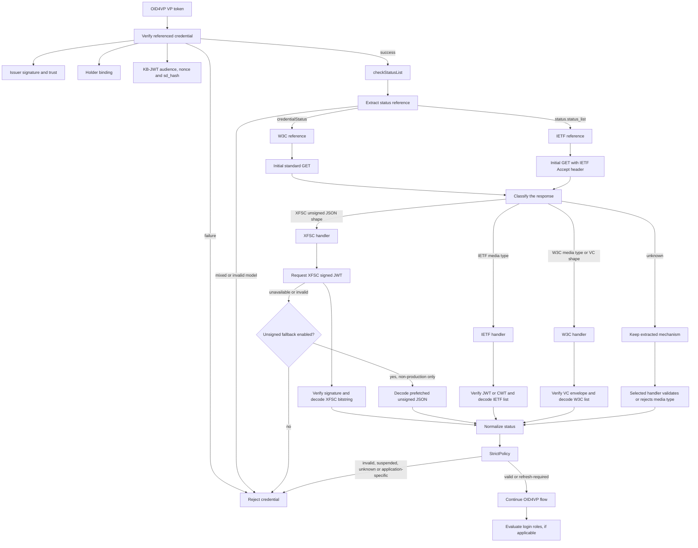
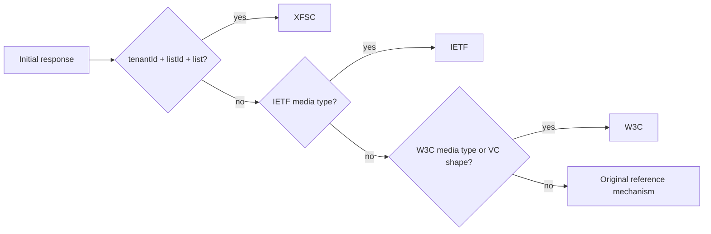
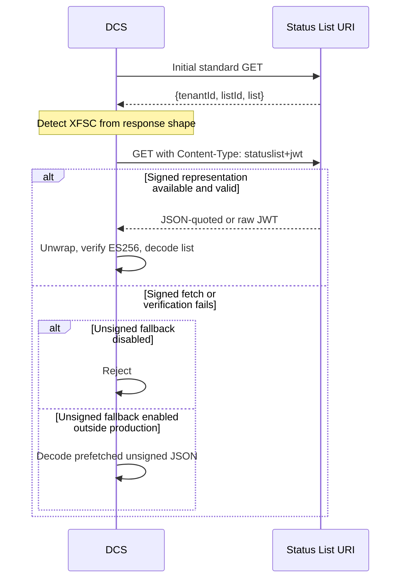

# DCS Status List Verification

**Last updated:** 2026-07-16  
**XFSC baseline:** `eclipse-xfsc/statuslist-service` commit [`f71c471`](https://github.com/eclipse-xfsc/statuslist-service/tree/f71c47180944b4bbd411db5c3d38254755505a8b)  
**Standards baseline:**

- [W3C Bitstring Status List v1.0](https://www.w3.org/TR/vc-bitstring-status-list/) — W3C Recommendation, 2025-05-15
- [IETF Token Status List](https://datatracker.ietf.org/doc/draft-ietf-oauth-status-list/) — draft-21, 2026-06-21; still an active Internet-Draft
- [XFSC statuslist-service issue #15](https://github.com/eclipse-xfsc/statuslist-service/issues/15)

## 1. Purpose

DCS verifies a credential status only after the credential itself has passed issuer trust, signature, holder-binding, and key-binding checks. It supports:

- W3C Bitstring Status List v1.0;
- IETF Token Status List JWT;
- a restricted IETF Token Status List CWT profile;
- XFSC-specific responses through an isolated compatibility handler.

The core design rule is:

> Use the standard request for the reference found in the credential, classify the returned response, and keep all XFSC exceptions outside the W3C and IETF handlers.

## 2. Code layout

The implementation is under `backend/internal/auth/oid4vp`:

```text
backend/internal/auth/oid4vp/
├── verify.go                         # OID4VP verification order
├── statuslist_verify.go              # DCS integration and configuration
└── status/
    ├── verifier.go                   # extract → fetch → classify → check → policy
    ├── detect.go                     # request headers and response classification
    ├── trust.go                      # status-list trust and key resolution
    ├── policy.go                     # status mapping and acceptance policy
    ├── reference/                    # W3C and IETF reference extraction
    ├── handler/
    │   ├── w3c_bitstring.go
    │   ├── ietf_token.go
    │   ├── xfsc.go
    │   └── trust_required.go
    ├── envelope/                     # JWT, COSE, CWT, Data Integrity
    ├── codec/                        # base64, GZIP/ZLIB, bit reading
    └── fetch/                        # bounded HTTP GET
```

## 3. End-to-end DCS flow



The verification order is implemented in `verify.go`:

```text
1. Credential trust and wallet binding
2. Status list verification
3. Login-role authorization
```

A status lookup is therefore not performed for an untrusted or otherwise invalid credential.

## 4. Reference extraction

`status/reference.Extract` supports two incompatible reference models and rejects a credential that contains both.

| Model | Credential fields | Initial mechanism |
|---|---|---|
| W3C | `credentialStatus.type`, `statusListCredential`, `statusListIndex`, `statusPurpose`, optional `statusSize` | `w3c-bitstring-v1` |
| IETF | `status.status_list.uri`, `status.status_list.idx` | `ietf-token-status-list` |

Current DCS behavior also rejects a credential when no supported status reference can be extracted.

## 5. Initial request and response-driven classification

DCS does not select XFSC by URL path and does not route every IETF reference through XFSC. The first request is based on the reference model extracted from the credential.

### 5.1 Initial request

| Extracted reference | Request |
|---|---|
| W3C | `GET {statusListCredential}` with no mechanism-specific request header |
| IETF | `GET {uri}` with `Accept: application/statuslist+jwt, application/statuslist+cwt` |

The response is stored in `Reference.Prefetched`. Standard handlers reuse this response, so the normal W3C/IETF path performs one status-list request.

### 5.2 Response classification

`status.SelectMechanismFromResponse` applies this order:

| Response | Selected handler |
|---|---|
| JSON object containing non-empty `tenantId`, `listId`, and `list` | XFSC |
| `Content-Type: application/statuslist+jwt` or `application/statuslist+cwt` | IETF |
| W3C VC media type, W3C VC-shaped JSON, or non-IETF compact JWT | W3C |
| Unknown response | Keep the mechanism extracted from the credential; the handler then validates or rejects it |

The XFSC JSON check excludes bodies containing standard fields such as `credentialSubject` or `status_list`, reducing accidental classification of standard documents as XFSC.



## 6. Trust and fail-closed behavior

All secured handlers require a status-list trust configuration before they use remote status data.

```go
func requireStatusTrust(trust *status.TrustConfig) error {
    if trust == nil {
        return status.ErrStatusTrustNotConfigured
    }
    return nil
}
```

This rule applies to:

- W3C JWT;
- W3C COSE;
- W3C Data Integrity proofs;
- IETF JWT;
- IETF CWT;
- XFSC signed JWT.

DCS never falls back from “signature cannot be verified” to “parse and trust the payload” in a standard W3C or IETF flow.

### Trust lookup

| Envelope | Key lookup |
|---|---|
| W3C/IETF/XFSC JWT | JWT `iss` or `issuer` → trusted P-256 key |
| W3C COSE VC | payload issuer → trusted P-256 key |
| W3C Data Integrity | `verificationMethod` controller → trusted ECDSA or Ed25519 key |
| IETF CWT | COSE `kid`, scoped to the Status List URI; optional CWT `iss` fallback |

## 7. W3C Bitstring Status List handling

### 7.1 Supported input

`handler.W3CBitstring` currently supports these secured representations:

| Representation | DCS verification |
|---|---|
| `application/vc+jwt` or compact JWT | ES256 JWS verification |
| `application/vc+cose` | COSE_Sign1 + ES256 verification |
| `application/vc` / `application/ld+json` | Data Integrity verification using `ecdsa-rdfc-2019` or `eddsa-rdfc-2022` |

Unsigned W3C JSON is rejected.

### 7.2 Structure and codec

DCS currently checks:

- `credentialStatus.type == BitstringStatusListEntry`;
- status list subject type `BitstringStatusList`;
- JWT status list type includes `BitstringStatusListCredential`;
- a non-empty `credentialSubject.encodedList`;
- matching `statusPurpose` when both values are present;
- index range.

The list is decoded as required by the W3C format:

```text
encodedList
  → require multibase prefix "u"
  → base64url without padding
  → GZIP decompression
  → read statusSize bits in MSB-first order
```

A zero value is valid. A non-zero value is mapped using `statusPurpose`:

| Purpose | DCS state |
|---|---|
| `revocation` | `invalid` |
| `suspension` | `suspended` |
| `refresh` | `refresh_required` |
| `message` | `application_specific` |
| missing/unknown | `unknown` |

## 8. IETF Token Status List handling

### 8.1 JWT

For `application/statuslist+jwt`, DCS requires:

- ES256 signature verification;
- a trusted JWT issuer;
- `typ == statuslist+jwt`;
- exact string equality between JWT `sub` and the referenced `uri`;
- valid `exp` and `nbf` when present;
- `status_list.bits` equal to 1, 2, 4, or 8;
- base64url `status_list.lst`;
- ZLIB decompression;
- LSB-first bit reading.

### 8.2 CWT profile

DCS supports this explicit subset of draft-21:

```text
COSE_Sign1 tag 18
ES256
protected header 16 = "application/statuslist+cwt"
COSE kid = CBOR byte string containing the UTF-8 JWK kid
integer CWT claim labels
CBOR byte-string status_list.lst
```

The verifier requires CWT claims `2` (`sub`), `6` (`iat`), and `65533` (`status_list`), validates optional `4` (`exp`), `5` (`nbf`), and positive `65534` (`ttl`), rejects duplicate protected/unprotected `kid`, and scopes key lookup by Status List URI.

The current implementation does not support COSE_Mac0, numeric CoAP Content-Format type identifiers, or algorithms other than ES256.

### 8.3 Status value mapping

| Raw value | DCS state |
|---:|---|
| `0x00` | `valid` |
| `0x01` | `invalid` |
| `0x02` | `suspended` |
| `0x03`, `0x0C`–`0x0F` | `application_specific` |
| all other values | `unknown` |

## 9. XFSC compatibility flow

XFSC is detected only when the initial response has this private envelope:

```json
{
  "tenantId": "default",
  "listId": 1,
  "list": "H4sI..."
}
```

This first response identifies the provider as XFSC. DCS does not normally use it as the authoritative status result.



### XFSC signed-list rules in DCS

- request header: `Content-Type: statuslist+jwt`;
- no `Accept` header is used for this XFSC-specific request;
- JSON-quoted compact JWT bodies are unwrapped;
- ES256 signature is verified using JWT `iss`;
- `typ` may be `statuslist+jwt` or the observed XFSC value `JWT`;
- `sub` mismatch is logged but does not reject the list;
- `status_list.lst` accepts standard or URL-safe base64, padded or unpadded;
- payload is GZIP-decompressed;
- entries are read LSB-first.

All XFSC exceptions are contained in `status/handler/xfsc.go` and are not accepted by the standard IETF handler.

## 10. XFSC deviations at commit `f71c471`

The XFSC service is not a conforming W3C Bitstring Status List or IETF Token Status List implementation. Its signed representation is structurally closer to IETF, but combines that structure with different transport, compression, encoding, URI, and time behavior.

| Area | W3C / IETF requirement | XFSC `f71c471` behavior | DCS handling |
|---|---|---|---|
| Default response | W3C returns a secured `BitstringStatusListCredential`; IETF returns a secured JWT/CWT | Returns unsigned `{tenantId,listId,list}` JSON | Use only to detect XFSC; accept status data only through explicit non-production fallback |
| Content negotiation | IETF client uses `Accept`; server returns matching `Content-Type` | Reads request `Content-Type`; empty or `application/json` returns JSON | After detection, issue XFSC-specific request with `Content-Type: statuslist+jwt` |
| Signed response body | IETF response body is the raw JWT/CWT | `ctx.JSON(..., string(token))` returns a JSON string containing the JWT | Unwrap the JSON string before JWS verification |
| JWT `typ` | IETF requires `statuslist+jwt` | Deployed integration observed `typ: JWT`; service signing request itself supplies only `kid` | XFSC handler accepts `JWT` or `statuslist+jwt`; IETF handler remains strict |
| Token URI | IETF `sub` must exactly equal the credential reference `uri` | Service builds `sub` as `{host}/statuslists/{id}`, while retrieval commonly uses `/status/{id}` | Log the known mismatch and continue only in XFSC handler |
| Compression | W3C uses GZIP; IETF uses DEFLATE with ZLIB wrapper | Uses GZIP inside an IETF-shaped `status_list.lst` | XFSC handler uses GZIP; IETF handler uses ZLIB only |
| Base64 | W3C uses multibase base64url; IETF JWT uses base64url without padding | Uses `base64.RawStdEncoding` | XFSC handler uses flexible base64 decoding |
| Time claims | JWT/CWT NumericDate values are seconds since Unix epoch | Uses Go `UnixMilli()` for `iat` and `exp` | No conversion is currently applied; this remains an XFSC conformance issue |
| Specification basis | Current IETF baseline is draft-21 | Source comment refers to `draft-looker-oauth-jwt-cwt-status-list-01` | Treat the output as an XFSC compatibility profile, not as standard IETF |

### Important interpretation

The XFSC signed JWT must not be described as W3C simply because it uses GZIP. It is also not standard IETF simply because it contains `status_list.bits` and `status_list.lst`. It is an XFSC-specific mixed format and must remain isolated from both strict handlers.

## 11. Acceptance policy

`status.StrictPolicy` applies the normalized state consistently across all mechanisms:

| Normalized state | Credential decision |
|---|---|
| `valid` | Accept |
| `refresh_required` | Accept; the credential is not invalidated |
| `invalid` | Reject |
| `suspended` | Reject |
| `unknown` | Reject |
| `application_specific` | Reject because DCS has no safe business interpretation |

If multiple references are present, any rejecting state rejects the credential.

## 12. Resource limits

The current implementation applies these basic limits:

- default HTTP timeout: 10 seconds;
- maximum HTTP response: 16 MiB;
- maximum decompressed list: 1 MiB;
- explicit index bounds checking;
- status entry width limited to 1–8 bits in the shared reader; IETF accepts only 1, 2, 4, or 8.

## 13. Current standards coverage boundaries

The implementation covers the core secured processing paths, but the following items should not yet be described as complete W3C/IETF conformance.

### W3C gaps

- `statusListIndex` is currently accepted as either a string or a numeric JSON value; W3C requires a base-10 string.
- `statusPurpose` is not yet strictly required on both the entry and list.
- `statusMessage` cardinality and contents are not validated for multi-bit entries.
- The W3C minimum of 131,072 entries / 16 KiB uncompressed data is not enforced.
- `validFrom`, `validUntil`, and list `ttl` are not evaluated.
- The top-level `BitstringStatusListCredential` type is enforced for JWT, but not yet equally for every COSE/Data Integrity path.
- When a Data Integrity credential contains multiple proofs, the current verifier checks the first proof rather than requiring all proofs to pass.

### IETF gaps and profile restrictions

- JWT `iat` is not currently enforced as a required claim, although CWT `iat` is enforced.
- `ttl` is parsed for CWT but is not yet used for caching; JWT `ttl` is not validated as a positive value.
- JWT verification requires `iss` for trust-key lookup, which is a DCS profile restriction.
- JWT key selection currently resolves the first usable P-256 key for an issuer rather than selecting by JWT `kid`.
- CWT support is intentionally limited to COSE_Sign1 + ES256 + textual media type.

### Operational gaps

- The fetch layer does not yet implement SSRF protection, status-provider host allowlists, or redirect/DNS-rebinding restrictions.
- Status-list caching based on W3C `ttl`, IETF `ttl`/`exp`, and HTTP cache headers is not implemented.

These items should be addressed before making a broad claim of full standards compliance.

## 14. Important tests

The implementation contains focused tests for the high-risk paths, including:

- no global XFSC probe and one-request standard IETF flow;
- response-shaped XFSC detection without URL-based routing;
- XFSC signed retrieval before unsigned fallback;
- production rejection of unsigned XFSC fallback;
- fail-closed behavior for W3C JWT, COSE, Data Integrity and IETF JWT/CWT;
- exact IETF `sub == uri` comparison;
- IETF CWT draft-21 example structure and negative cases;
- URI-scoped CWT `kid` trust resolution;
- W3C MSB-first and IETF/XFSC LSB-first bit reading;
- active and revoked end-to-end status results.

Representative test files:

```text
status/verifier_test.go
status/detect_test.go
status/handler/w3c_bitstring_test.go
status/handler/ietf_token_test.go
status/handler/xfsc_test.go
status/envelope/cwt_test.go
status/trust_test.go
statuslist_verify_test.go
```

## 15. Implementation rules for future changes

1. Do not classify XFSC by URI path.
2. Do not route all IETF references through XFSC.
3. Do not weaken W3C or IETF validation to accommodate XFSC.
4. Detect XFSC only from its unsigned response envelope.
5. After XFSC detection, prefer the signed representation and verify it.
6. Keep unsigned fallback explicit, disabled by default, and prohibited in production.
7. Reuse the prefetched standard response so normal W3C/IETF verification does not issue duplicate requests.
8. When a signature or trust key cannot be verified, fail closed.
9. Add a negative test for every new compatibility exception.

## 16. References

- W3C, [Bitstring Status List v1.0](https://www.w3.org/TR/vc-bitstring-status-list/)
- IETF OAuth WG, [Token Status List](https://datatracker.ietf.org/doc/draft-ietf-oauth-status-list/)
- IETF OAuth WG, [Token Status List draft-21](https://datatracker.ietf.org/doc/html/draft-ietf-oauth-status-list-21)
- Eclipse XFSC, [statuslist-service at f71c471](https://github.com/eclipse-xfsc/statuslist-service/tree/f71c47180944b4bbd411db5c3d38254755505a8b)
- Eclipse XFSC, [Issue #15: current implementation and IETF compatibility](https://github.com/eclipse-xfsc/statuslist-service/issues/15)
